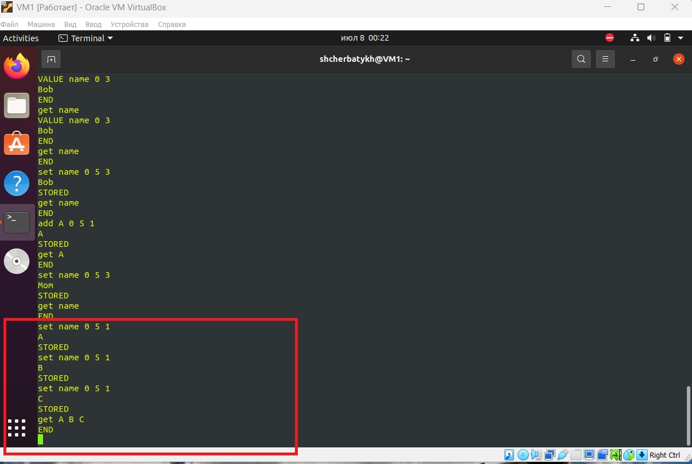
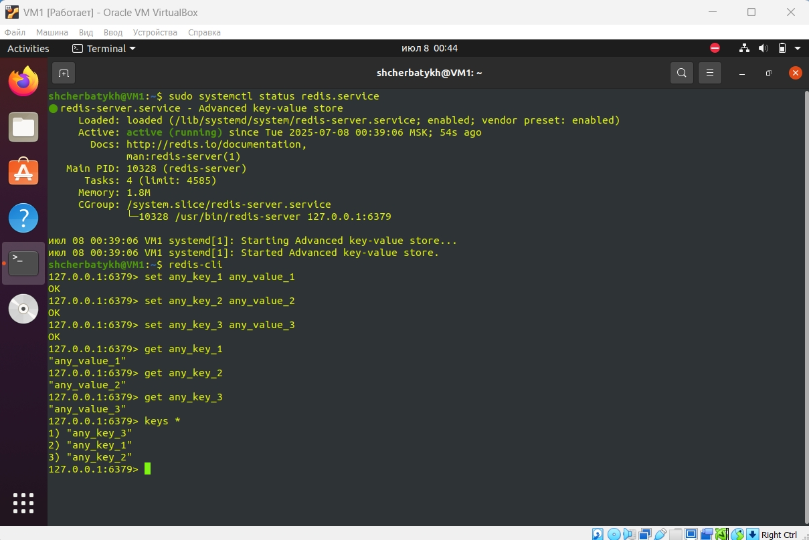

## Домашнее задание к занятию «Кеширование Redis/memcached» (Щербатых А.Е.)
### Задание 1. Кеширование
Приведите примеры проблем, которые может решить кеширование.
### Ответ
1. Повышение производительности.
2. Увеличение скорости ответа.
3. Экономия ресурсов. Например, время.
4. Снижение нагрузки на базу данных.
5. Сглаживание бустов трафика.

### Задание 2. Memcached
Установите и запустите memcached.

Приведите скриншот systemctl status memcached, где будет видно, что memcached запущен.

### Задание 3. Удаление по TTL в Memcached
Запишите в memcached несколько ключей с любыми именами и значениями, для которых выставлен TTL 5.

Приведите скриншот, на котором видно, что спустя 5 секунд ключи удалились из базы.

### Задание 4. Запись данных в Redis
Запишите в Redis несколько ключей с любыми именами и значениями.

Через redis-cli достаньте все записанные ключи и значения из базы, приведите скриншот этой операции.

